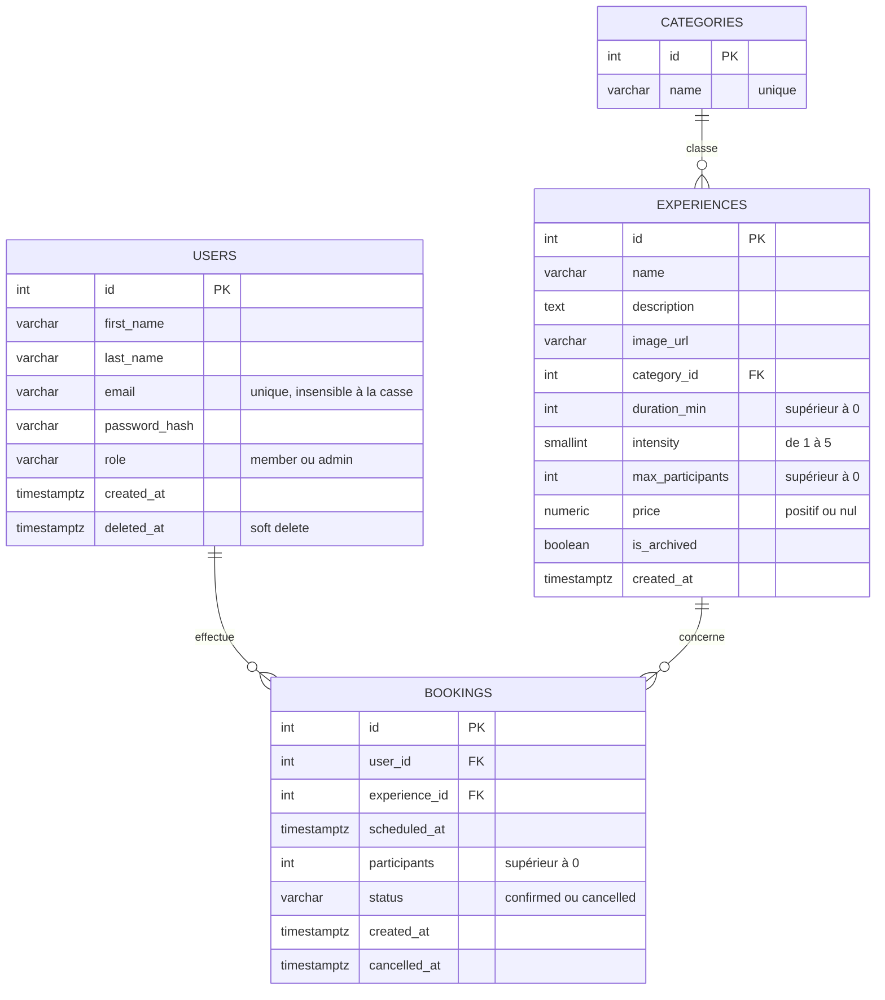
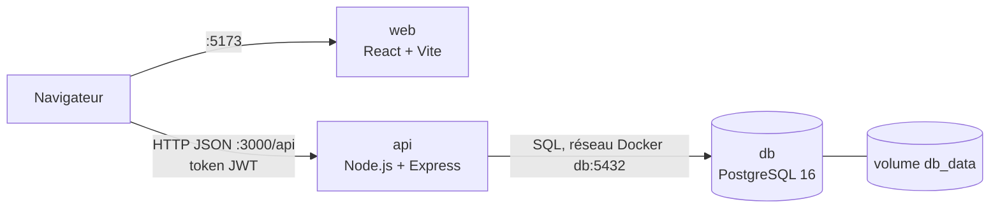
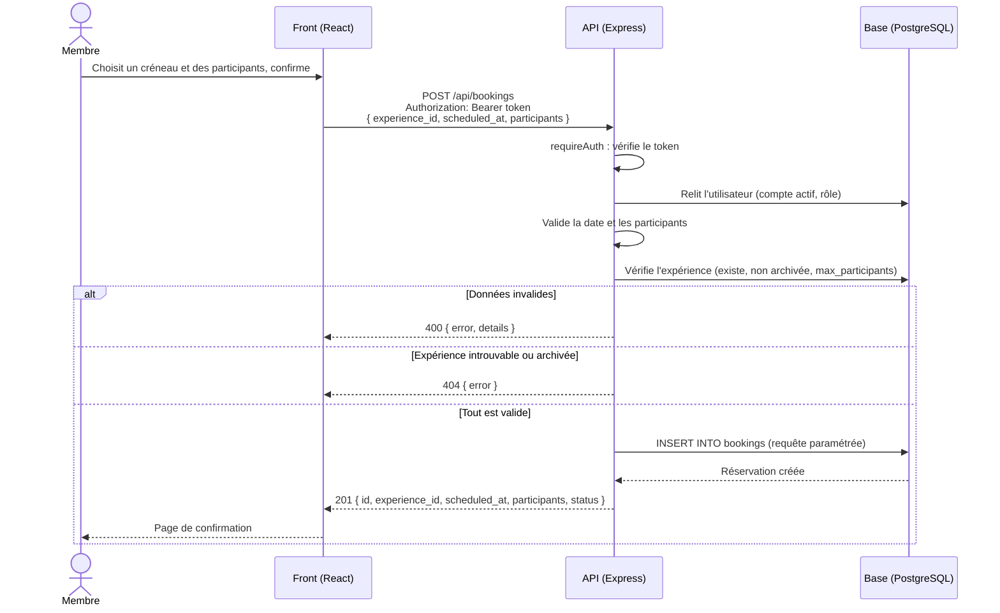

# NIGHTFALL - Conception du projet

> Ce document a été rédigé le jour 1, avant le développement. Il est conservé pour montrer la démarche de conception, et mis à jour avec l'état final du projet. Les écarts entre ce qui était prévu et ce qui a été livré sont expliqués dans la section [5. Évolutions depuis la conception](#5-évolutions-depuis-la-conception).
>
> Références de l'état final : [`db/01_schema.sql`](../db/01_schema.sql) pour les données, [`docs/routesAPI.md`](routesAPI.md) pour l'API.

## 1. Comprendre le besoin

### a. Les différents types d'utilisateurs

- **Visiteurs** : consultent le catalogue sans compte.
- **Membres** : réservent des expériences et gèrent leurs réservations.
- **Administrateurs** : gèrent le catalogue et suivent l'ensemble des réservations.

### b. Les fonctionnalités principales attendues

- Catalogue des expériences
- Recherche et filtres
- Fiche détaillée des expériences
- Système de réservation
- Comptes utilisateurs
- Espace personnel
- Annulation
- Interface administrateur

### c. Les données nécessaires au fonctionnement de l'application

**Modèle prévu au jour 1**

- Users : id, nom, email, mot de passe (haché), rôle (admin / membre), date de création
- Categories : id, nom, description
- Experiences : id, titre, description, catégorie, prix, intensité, durée, capacité, images, statut (actif / archivé)
- Sessions (créneaux) : id, expérience, date et heure, places restantes
- Bookings : id, utilisateur, expérience / session, nombre de places, statut (confirmée / annulée), date de réservation, date d'annulation

**Modèle final**

| Relation | Règle de suppression | Pourquoi |
|---|---|---|
| `experiences.category_id` → `categories` | `RESTRICT` | Une catégorie encore utilisée ne peut pas être supprimée |
| `bookings.experience_id` → `experiences` | `RESTRICT` | Une expérience réservée ne peut pas être supprimée : elle est archivée (`is_archived`) |
| `bookings.user_id` → `users` | `CASCADE` | Une vraie suppression de compte effacerait ses réservations : on utilise donc un *soft delete* (`deleted_at`) |

**Garanties assurées par la base**

- Contraintes `CHECK` sur le rôle, l'intensité, la durée, le nombre de participants, le prix et le statut.
- `chk_bookings_cancelled` : une réservation a une date d'annulation si et seulement si elle est annulée.
- Unicité de l'email sans tenir compte de la casse (`idx_users_email_lower`) : `Alice@x.com` et `alice@x.com` sont le même compte.
- Dates en `TIMESTAMPTZ`, stockées avec leur fuseau, pour un calcul fiable de la règle des 48 h.

**Règles vérifiées par l'API**, car elles dépendent du moment présent ou d'une autre table :

- la date de réservation est dans le futur ;
- le nombre de participants ne dépasse pas `max_participants` de l'expérience ;
- l'annulation n'est possible qu'à plus de 48 h de `scheduled_at`.

### d. Les interactions entre le Front-end, le Back-end et la base de données

- **Front-end (React)** : envoie des requêtes HTTP (Fetch) vers l'API REST, conserve le token JWT et gère l'état de l'interface. Le code s'exécute dans le navigateur : il appelle l'API sur `localhost:3000/api`.
- **Back-end (Express)** : vérifie l'authentification et les droits (middlewares `requireAuth` et `requireAdmin`), valide les données, applique les règles métier (date future, capacité, délai d'annulation de 48 h), puis lit ou écrit en base avec des requêtes paramétrées.
- **Base de données (PostgreSQL)** : stocke les données dans le volume `db_data` et garantit leur cohérence. Seule l'API y accède, par le nom de service `db` sur le réseau interne de Docker.
- **Initialisation** : au premier démarrage, PostgreSQL exécute `db/01_schema.sql` puis `db/02_seed.sql`.

**Flux type : une réservation**

## 2. Organiser le développement

### a. Les fonctionnalités à développer en priorité

- Modélisation de la base + seed
- Authentification (inscription, connexion, JWT, rôles)
- Catalogue et fiche détaillée des expériences
- Système de réservation
- Docker Compose + `.env`

### b. Les fonctionnalités obligatoires intégrées ensuite

- Recherche et filtres (catégorie, prix, intensité)
- Espace personnel (historique des réservations)
- Annulation avec la règle des 48 h
- Interface administrateur (création, modification, archivage et restauration des expériences, suivi des réservations)
- Responsive design et charte graphique NIGHTFALL
- Tests d'intégration et README final

### c. Les fonctionnalités supplémentaires, abordées seulement une fois le MVP terminé

- Avis et notes sur les expériences
- Favoris / liste de souhaits
- Notifications par email (confirmation, rappel, annulation)
- Paiement en ligne
- Statistiques avancées côté admin

## 3. Répartir les rôles

### a. Lead Back-end - Jason

**Rôle principal** : développer l'API REST Express et implémenter la logique métier.

**API REST et sécurité**
- Système d'authentification (hachage des mots de passe, tokens JWT).
- Routes de l'API (`/api/auth`, `/api/experiences`, `/api/bookings`, `/api/admin`).
- Contrôle des droits d'accès (middlewares `requireAuth` et `requireAdmin`).

**Règles métier**
- Validation stricte des données d'entrée (dates futures, capacité d'accueil).
- Logique d'annulation des réservations (vérification stricte du délai des 48 h).

### b. Lead Front-end (UX et public) - Tom

**Rôle principal** : réaliser l'interface utilisateur côté client (visiteur et membre) et gérer la logique d'état en React.

**Interface et parcours visiteur / membre**
- Composants du catalogue, cartes d'expériences et fiche détaillée.
- Recherche et filtre par catégorie.
- Formulaires de connexion et d'inscription, espace personnel, page Mon compte.

**Intégration et ergonomie**
- Responsive design (mobile et desktop) et charte graphique immersive (univers NIGHTFALL).
- Interface d'annulation côté membre (bouton désactivé à moins de 48 h).

**Connexion à l'API**
- Intégration des appels à l'API REST (Fetch) pour les fonctionnalités client.

### c. DevOps, base de données, espace admin et liaison - Benjamin

**Rôle principal** : assurer la conteneurisation Docker, concevoir la base de données, développer l'espace administrateur et faire la jonction entre le front et le back.

**DevOps et environnement**
- Configuration du `docker-compose.yml` (services React, Express et PostgreSQL).
- Supervision du dépôt GitHub (protection de `main`, politique de branches, relectures).
- Rédaction du README final avec la procédure de lancement.

**Base de données**
- Modélisation (`db/01_schema.sql`) et jeu de données de démonstration (`db/02_seed.sql`).

**Espace d'administration (front-end)**
- Gestion du catalogue : création, modification, archivage et restauration des expériences.
- Suivi global des réservations.

**Liaison et tests**
- Centralisation des variables d'environnement (`.env.example`).
- Resynchronisation du contrat d'API (`docs/routesAPI.md`) avec le code.
- Script de tests de l'API (`scripts/test-api.sh`) et recette complète du parcours (`docs/recette.md`).

## 4. Le dépôt GitHub

https://github.com/Holberton-Nightfall/holbertonschool-nightfall-project

## 5. Évolutions depuis la conception

| Prévu au jour 1 | Livré | Pourquoi |
|---|---|---|
| Table `Sessions` (créneaux avec places restantes) | Pas de table : les créneaux de nuit sont générés côté front, la réservation porte une date (`scheduled_at`) | Tenir le MVP en 4 jours. Limite assumée : la capacité cumulée par créneau n'est pas gérée |
| `Bookings` liée à une session | `bookings` liée directement à l'expérience, avec `scheduled_at` | Conséquence de l'absence de table des créneaux |
| Un champ « nom » pour l'utilisateur | `first_name` et `last_name` | Affichage et formulaires plus clairs |
| Suppression d'un compte | *Soft delete* avec `deleted_at` | Conserver l'historique des réservations (`ON DELETE CASCADE`) |
| `Categories` avec description | `categories` avec un nom unique seulement | La description n'était utilisée nulle part |
| Statut de l'expérience (actif / archivé) | Booléen `is_archived` | Deux états seulement, plus simple à filtrer |
| Plusieurs images par expérience | Une seule image (`image_url`) | Suffisant pour le catalogue et la fiche |
| Noms en camelCase (`intensityLevel`, `durationMinutes`) | `snake_case`, identiques aux colonnes SQL (`intensity`, `duration_min`) | Une seule convention, du schéma jusqu'au JSON de l'API |
| Catégories en anglais (Survival, Horror, Sci-Fi) | Catégories en français (Survie, Horreur, Science-fiction, Action, Escape Game) | Cohérence avec l'interface |
| Images dans `/images/` | Images dans `/images/experiences/` | Réorganisation des fichiers du front |
| CRUD des expériences par l'admin | Création, modification, archivage et restauration, sans suppression | L'archivage garde l'historique valide ; la base bloque de toute façon la suppression d'une expérience réservée |
| Routes admin mêlées aux routes publiques | Routes admin regroupées sous `/api/admin` | Un seul préfixe, protégé par le même middleware |
| Filtres par catégorie, prix et intensité | Tous gérés par l'API ; seuls la recherche et la catégorie sont proposées dans l'interface | Priorité donnée au parcours de réservation |
| Axios ou Fetch | Fetch, via un service commun (`services/api.js`) | Aucune dépendance supplémentaire |
| Base de données confiée au back-end | Schéma et seed écrits par Benjamin, API par Jason | Un seul schéma de référence, décidé en équipe après un travail en double |
| Dépôt sur un compte personnel | Dépôt transféré dans l'organisation `Holberton-Nightfall` | Gestion commune des droits |

## 6. Les expériences

La liste définitive des expériences est dans [`db/02_seed.sql`](../db/02_seed.sql). Station Kepler y est volontairement archivée : elle sert à montrer qu'une expérience retirée du catalogue garde ses réservations passées.

| Expérience | Catégorie | Durée | Intensité | Participants max | Prix | Statut |
|---|---|---|---|---|---|---|
| Le Bunker 7 — Protocole Lazare | Survie | 45 min | 4 | 6 | 35,00 € | Active |
| La Zone Morte — Évacuation d'Urgence | Action | 30 min | 3 | 10 | 28,00 € | Active |
| L'Abattoir — Le Festin des Mutants | Horreur | 50 min | 5 | 4 | 42,00 € | Active |
| La Ruche — Cyber-Infection | Science-fiction | 40 min | 3 | 8 | 32,00 € | Active |
| Le Convoi — Terre Brûlée | Action | 30 min | 2 | 20 | 25,00 € | Active |
| Ground Zero — La Dernière Résistance | Survie | 35 min | 4 | 15 | 38,00 € | Active |
| Le Laboratoire Omega — Code Rouge | Escape Game | 60 min | 2 | 6 | 30,00 € | Active |
| Station Kepler — Dernier Signal | Science-fiction | 40 min | 3 | 6 | 30,00 € | Archivée |

### Le Bunker 7 — Protocole Lazare
Équipe d'extraction envoyée dans un bunker souterrain. Réactivez le générateur principal et récupérez les recherches du Dr. Vance tout en échappant aux anciens occupants contaminés.

### La Zone Morte — Évacuation d'Urgence
Votre véhicule blindé est en panne en pleine zone de quarantaine. Le point d'extraction est à 500 mètres : courez, traversez des ruines et débloquez des accès sous une attaque constante de Rôdeurs.

### L'Abattoir — Le Festin des Mutants
Enchaînés dans une chambre froide, vous êtes aux mains d'une tribu de cannibales mutants. Libérez-vous et trouvez la sortie avant leur retour. Effets gore et obscurité totale.

### La Ruche — Cyber-Infection
Une IA tente d'infecter l'humanité avec un nano-virus. Infiltrez le complexe, hackez les terminaux et évitez les drones ainsi que les humains « Transférés » pour détruire le noyau central.

### Le Convoi — Terre Brûlée
Traversez un canyon désertique à bord de camions blindés. Équipés de lanceurs, défendez le convoi contre les vagues de pillards en buggys.

### Ground Zero — La Dernière Résistance
Retranchés dans une église fortifiée, tenez votre position pendant 20 minutes avec des munitions limitées. Barricadez les accès et repoussez les hordes en attendant l'hélicoptère d'évacuation.

### Le Laboratoire Omega — Code Rouge
Une fuite a déclenché le confinement du laboratoire Omega. Vous avez 60 minutes pour résoudre les énigmes du système de sécurité, reconstituer l'antidote et ouvrir le sas avant la stérilisation totale du bâtiment.

### Station Kepler — Dernier Signal
Ancienne expérience : l'équipage d'une station orbitale ne répond plus. Rétablissez le contact avant la chute de l'orbite.